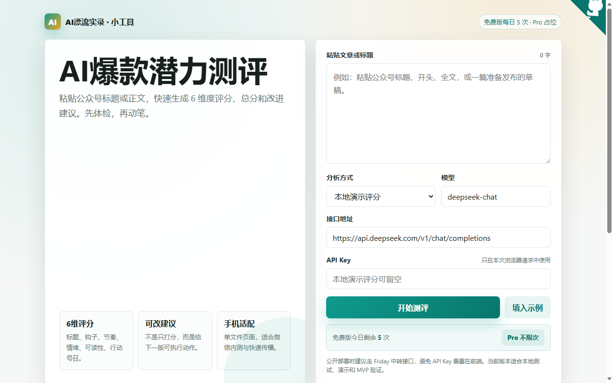

# AI Viral Article Evaluator

> An open-source pre-publishing checklist for WeChat public account writers. Paste a title and article draft, then get a 6-dimension score with actionable revision suggestions.

[](https://allen-140032.github.io/wen-zhang-ce-ping/)
[](LICENSE.md)
[](CONTRIBUTING.md)

## Why this exists

Many independent writers and small content teams publish WeChat articles based mostly on intuition. Before publishing, they still need to answer practical questions:

- Is the title specific enough to earn a click?
- Does the opening paragraph create a strong hook?
- Is the pacing suitable for mobile reading?
- Does the article have an emotional curve?
- Is the call to action clear enough?

AI Viral Article Evaluator turns this editorial checklist into a lightweight browser-based tool. It helps creators review drafts before publishing and build a repeatable content improvement workflow.

## Features

| Dimension | Score | What it checks |
|:--|:--:|:--|
| Title Appeal | 1-10 | Specificity, contrast, pain points, curiosity, and value clarity |
| Opening Hook | 1-10 | Whether the first screen creates a problem, conflict, or result |
| Paragraph Rhythm | 1-10 | Paragraph length, heading density, and mobile reading pressure |
| Emotional Curve | 1-10 | Emotional turns, tension, payoff, and shareability |
| Readability | 1-10 | Sentence length, jargon density, and clarity |
| Call to Action | 1-10 | Follow, comment, save, share, or read-next prompts |

The tool returns a 60-point total score, dimension-level feedback, and practical revision suggestions.

## Live demo

https://allen-140032.github.io/wen-zhang-ce-ping/

## Local usage

```bash
git clone https://github.com/Allen-140032/wen-zhang-ce-ping.git
cd wen-zhang-ce-ping
```

Then open `index.html` in a browser.

The current version is a zero-dependency frontend app. No Node.js, Python, or backend service is required for the default local demo mode.

## Screenshots



## Tech stack

- HTML / CSS / JavaScript
- LocalStorage for local history and usage state
- GitHub Pages static hosting

## Data and privacy

- The default demo mode runs locally in the browser.
- Article history is stored in the user's own browser LocalStorage.
- When users explicitly choose a third-party API mode, article text is sent to the API endpoint configured by the user.
- The project does not include a backend database and does not collect article drafts by default.

See [PRIVACY.md](PRIVACY.md).

## Scoring rules

The current MVP uses transparent editorial heuristics and does not claim to objectively predict real-world traffic. See [SCORING_RULES.md](SCORING_RULES.md).

## Roadmap

- [x] Local demo scoring
- [x] GitHub Pages deployment
- [x] Evaluation history
- [x] Copyable report output
- [ ] More transparent scoring explanations
- [ ] Configurable evaluation dimensions
- [ ] Multilingual UI and documentation
- [ ] Chrome / Edge extension version
- [ ] Automated tests and release workflow

## Contributing

Issues and pull requests are welcome. Areas where help is especially useful:

- Better scoring dimensions and heuristics
- Mobile reading experience improvements
- Exporting reports as images or PDFs
- Extension permission and privacy documentation
- English UI and localization

See [CONTRIBUTING.md](CONTRIBUTING.md).

## License

MIT License © 2026 Three-Body Work Group
